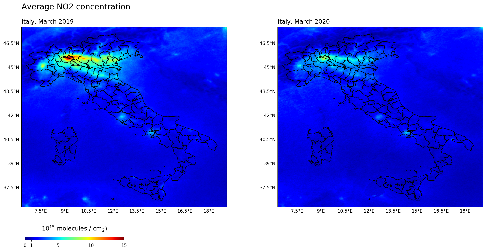

# COVID-19 and Air Pollution
## Exploring the effect of COVID-19 in air pollution, using data from the Sentinel-5P satellite

I used the `sentinelsat` , `harp` and `cartopy` libraries to download, process and visualize the NO2 satellite data.
If you wish to do similar analysis on a different region, it is easy to modify the Python scripts to accomplish that.

